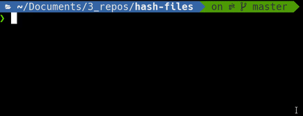

# Hash files utility

Create a basic hash of a directory recursively, ignoring `.git` and `node_modules`.

## Install

- Node.js v10+ required
- install with `npm install -g @jeremiec/hash-files` (`yarn add -g @jeremiec/hash-files`)

## Usage

- run it: `hashFiles <directory path or file path>`

